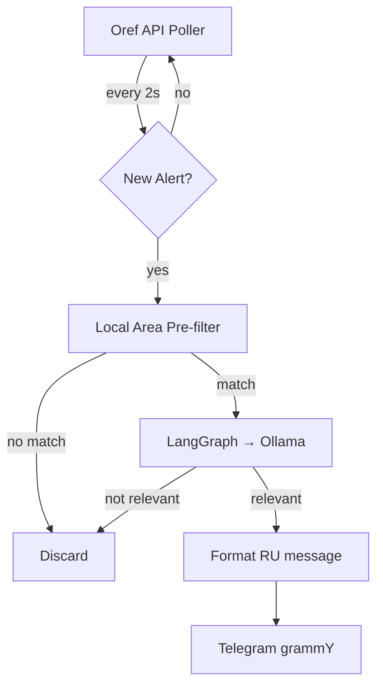

# Architecture

## Overview

EasyOref is a single-process Node.js service that runs a polling loop + LangGraph agent.



## Two-stage filtering

1. **Local pre-filter** — fast string match against `RELEVANT_AREAS` array
   - If no area matches Tel Aviv / Dan cities → skip LLM entirely
   - This saves Ollama calls for ~90% of alerts (most are northern/southern)

2. **LLM classification** — Ollama (gemma3:1b) confirms relevance and generates Russian summary
   - Only called when local pre-filter finds a match
   - Returns structured JSON with `relevant`, `matched_areas`, `summary_ru`

## Ollama Networking

### On Mac (local dev)
```
Host Ollama (port 11434) ← Docker bot via host.docker.internal
```

### On RPi (production)
```
Option A: Shared cybermem Ollama → bot joins cybermem-network
Option B: Own Ollama container → easyoref-network
```

## Health Endpoint

`GET /health` on port 3100 returns:
```json
{
  "status": "ok",
  "service": "easyoref",
  "uptime": 12345.67,
  "seen_alerts": 42
}
```

Used by Docker healthcheck, Ansible deployment verification, and monitoring.
