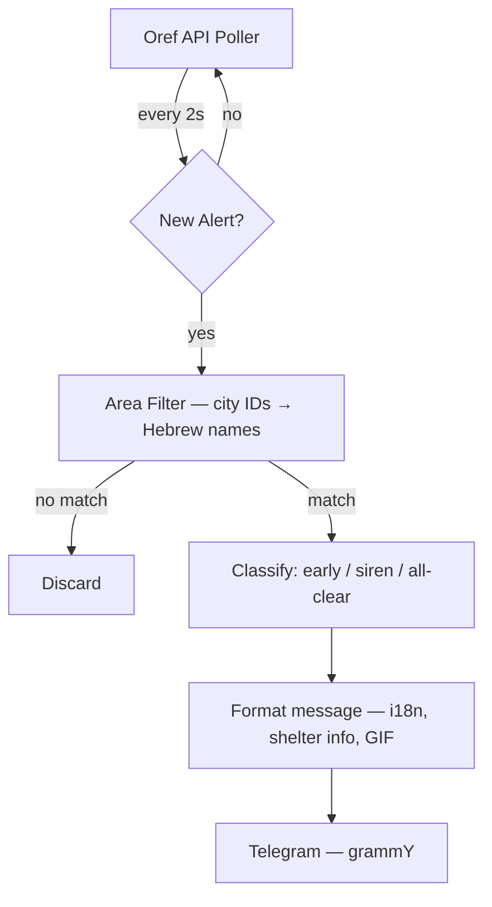

# Architecture

## Overview

EasyOref is a single-process Node.js service that polls the Home Front Command API and sends relevant alerts to a Telegram chat.



No LLM, no external AI — purely deterministic matching with sub-second latency.

## Filtering

1. **City ID → area names** — on startup, `city_ids` from config are resolved to Hebrew area names via the bundled cities.json
2. **Area match** — each alert's areas are compared against the resolved set; prefix matching handles sub-areas
3. **Alert type filter** — `alert_types` config restricts which types are forwarded (early, siren, resolved)
4. **Cooldown** — 30-second dedup window per alert type prevents notification spam

## Message Format

- HTML blockquote with emoji per alert type
- i18n templates in 4 languages (ru, en, he, ar)
- Shelter-oriented descriptions ("go to shelter", "stay alert", "you can leave")
- Optional GIF attachment: `funny_cats`, `assertive`, `pikud_haoref`, or `none`
- Custom title/description overrides per alert type

## Health Endpoint

`GET /health` on port 3100 returns:

```json
{
  "status": "ok",
  "service": "easyoref",
  "uptime": 12345.67,
  "seen_alerts": 42
}
```

Used by Docker healthcheck and monitoring.

## Observability

Optional Better Stack (Logtail) integration — set `observability.betterstack_token` in config.yaml. See [MONITORING.md](MONITORING.md).
